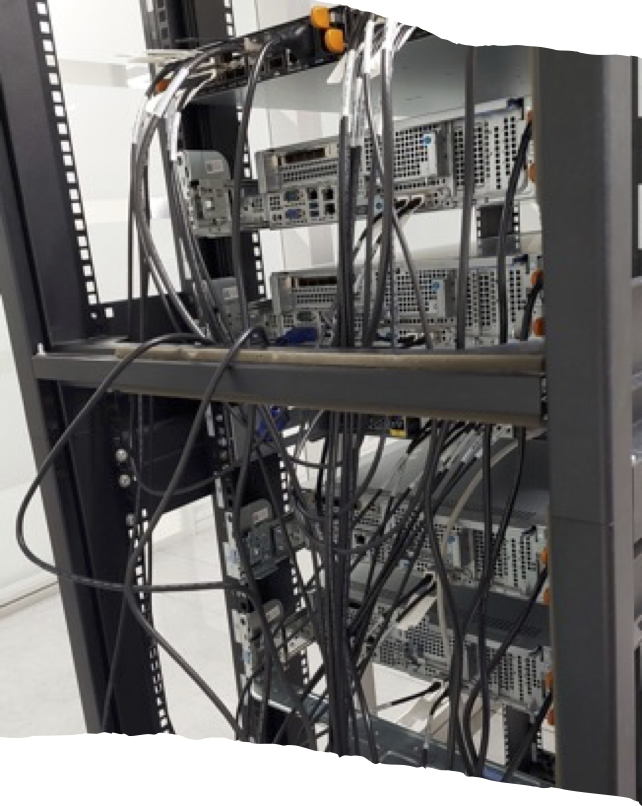
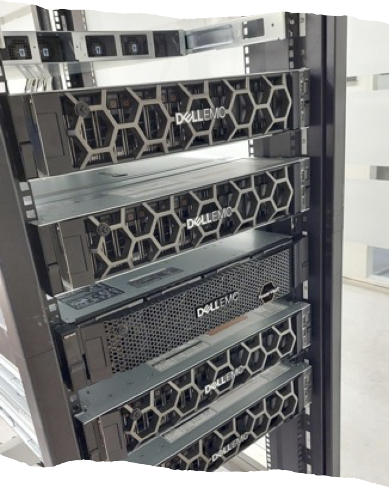

High Performance Computing platform of Kristiania!
==================================================

Welcome to HPC cluster of Kristiania!
------------------------------------------

The High Performance Computing (HPC) platform at Kristiania University
College provides students and researchers with the resources they need
to conduct complex experiments in science, engineering and mathematics.
HPC environments provide significant computational power for scientific
and data-intensive tasks.
Slurm is a popular job scheduler used to efficiently manage and
distribute computing resources on an HPC cluster.
This guide will walk you through the basics of getting started with
HPC usage using Slurm.

.. Note::

    We would like to inform you that our project is currently in the 
    experimental stage. During this phase, we are actively testing and 
    refining various aspects of the project, including features, performance, 
    and user experience.

.. toctree::

    specification
    usage
    storage
    access
    equipment
    publications
    support
    about
